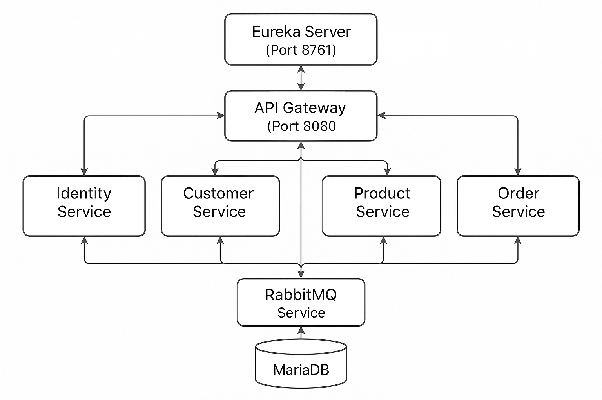

# Hệ thống Microservices Thương mại điện tử

## Giới thiệu chung

Dự án này là một hệ thống microservices được xây dựng bằng Spring Boot và Spring Cloud, tập trung vào việc xây dựng một nền tảng thương mại điện tử với các dịch vụ riêng biệt cho từng chức năng như quản lý khách hàng, sản phẩm, đơn hàng, xác thực người dùng, và gateway API. Dự án được phát triển qua 2 giai đoạn:

- **Tuần 6**: Triển khai các microservices cơ bản chạy trên máy local
- **Tuần 7**: Containerization toàn bộ hệ thống với Docker, nâng cao khả năng mở rộng và triển khai

## Kiến trúc hệ thống



Hệ thống bao gồm các thành phần chính sau:

### 1. Eureka Server (Port 8761)

Service discovery, giúp đăng ký và quản lý tất cả các microservice trong hệ thống. Các service khác đăng ký với Eureka Server và sử dụng nó để tìm kiếm và giao tiếp với nhau.

### 2. API Gateway (Port 8080)

Cổng vào chính của hệ thống, điều hướng các request từ client đến các microservice phù hợp. Xử lý việc xác thực JWT và bảo mật cho toàn hệ thống. Gateway cấu hình các route sau:

- `/auth/**` -> Identity Service (xác thực)
- `/products/**` -> Product Service (quản lý sản phẩm)
- `/orders/**` -> Order Service (quản lý đơn hàng)
- `/customers/**` -> Customer Service (quản lý khách hàng)

### 3. Identity Service

Chịu trách nhiệm xác thực người dùng, tạo JWT token và quản lý thông tin đăng nhập. Service này cung cấp các endpoint cho đăng nhập, đăng ký và quản lý xác thực.

### 4. Customer Service

Quản lý thông tin khách hàng, bao gồm đăng ký, cập nhật thông tin cá nhân và quản lý tài khoản.

### 5. Product Service

Quản lý danh mục sản phẩm, thông tin sản phẩm, giá cả, tồn kho và các thuộc tính khác của sản phẩm.

### 6. Order Service

Xử lý đơn hàng, bao gồm tạo đơn hàng mới, cập nhật trạng thái đơn hàng, và quản lý lịch sử đơn hàng.

### 7. RabbitMQ Service

Message broker giúp các microservice giao tiếp với nhau thông qua hàng đợi tin nhắn, đảm bảo tính nhất quán và độ tin cậy trong giao tiếp giữa các service.

### 8. MariaDB (Tuần 7)

Cơ sở dữ liệu quan hệ được sử dụng để lưu trữ dữ liệu cho các service.

## Công nghệ sử dụng

- **Spring Boot 3.4.4**: Framework Java để phát triển các ứng dụng standalone
- **Spring Cloud 2024.0.1**: Tập hợp các công cụ phát triển microservices
- **Java 17**: Ngôn ngữ lập trình chính của dự án
- **Spring Cloud Gateway**: Cổng API để điều hướng các request
- **Spring Cloud Netflix Eureka**: Service discovery để quản lý các microservice
- **Spring Security**: Bảo mật cho ứng dụng
- **JWT (JSON Web Token)**: Xác thực và phân quyền người dùng
- **Maven**: Công cụ quản lý phụ thuộc và build project
- **RabbitMQ**: Message broker để giao tiếp giữa các service
- **Docker & Docker Compose**: Containerization và quản lý containers (Tuần 7)
- **MariaDB**: Hệ quản trị cơ sở dữ liệu quan hệ (Tuần 7)

## Chi tiết triển khai

# Tuần 6: Microservices cơ bản

## Cài đặt và Khởi động (Tuần 6)

### Yêu cầu hệ thống

- JDK 17 hoặc cao hơn
- Maven 3.6.3 hoặc cao hơn
- Docker và Docker Compose (cho RabbitMQ)

### Bước 1: Clone dự án

```bash
git clone <repository-url>
cd BaiTapThucHanhKienTrucTuan05
```

### Bước 2: Khởi động Eureka Server

```bash
cd week06/eureka-server
./mvnw spring-boot:run
```

### Bước 3: Khởi động RabbitMQ (nếu cần)

```bash
cd week06/rabbitmq-service
docker-compose up -d
```

### Bước 4: Khởi động các Microservice (chạy từng lệnh trong các cửa sổ terminal riêng biệt)

```bash
# Identity Service
cd week06/identity-service
./mvnw spring-boot:run

# Customer Service
cd week06/customer-service
./mvnw spring-boot:run

# Product Service
cd week06/product-service
./mvnw spring-boot:run

# Order Service
cd week06/order-service
./mvnw spring-boot:run
```

### Bước 5: Khởi động API Gateway

```bash
cd week06/api-gateway
./mvnw spring-boot:run
```

## Cấu trúc dự án (Tuần 6)

```
week06/
├── api-gateway/           # API Gateway Service
├── customer-service/      # Customer Management Service
├── eureka-server/         # Service Discovery
├── identity-service/      # Authentication & Authorization Service
├── order-service/         # Order Management Service
├── product-service/       # Product Management Service
└── rabbitmq-service/      # Message Broker Configuration
```

# Tuần 7: Containerization với Docker

## Cài đặt và Khởi động (Tuần 7)

### Yêu cầu hệ thống

- Docker Engine
- Docker Compose

### Bước 1: Clone dự án

```bash
git clone <repository-url>
cd BaiTapThucHanhKienTrucTuan05
```

### Bước 2: Khởi động toàn bộ hệ thống với Docker Compose

```bash
cd week07
docker-compose up -d
```

Lệnh này sẽ:

1. Build các Docker images cho tất cả các services
2. Tạo và khởi động các containers
3. Thiết lập mạng Docker để các services có thể giao tiếp với nhau
4. Khởi động MariaDB và RabbitMQ

### Bước 3: Kiểm tra trạng thái các services

```bash
docker-compose ps
```

### Bước 4: Xem logs của các services (nếu cần)

```bash
# Xem log của một service cụ thể
docker-compose logs api-gateway

# Xem logs theo dõi thời gian thực
docker-compose logs -f
```

### Dừng và xóa các containers

```bash
docker-compose down
```

## Cấu trúc dự án (Tuần 7)

```
week07/
├── api-gateway/           # API Gateway Service với Dockerfile
├── customer-service/      # Customer Management Service với Dockerfile
├── docker-compose.yml     # Cấu hình Docker Compose cho toàn bộ hệ thống
├── eureka-server/         # Service Discovery với Dockerfile
├── order-service/         # Order Management Service với Dockerfile
├── product-service/       # Product Management Service với Dockerfile
└── rabbitmq-server/       # Cấu hình RabbitMQ
```

## Cấu hình Docker

Mỗi service đều có một Dockerfile riêng để tạo Docker image. Docker Compose được sử dụng để điều phối các containers và cấu hình mạng. Hệ thống sử dụng một mạng Docker bridge để các services có thể giao tiếp với nhau.

Các ports được expose:

- MariaDB: 3306
- RabbitMQ: 5672 (AMQP), 15672 (Management UI)
- Eureka Server: 8761
- API Gateway: 8080
- Product Service: 8082
- Order Service: 8083
- Customer Service: 8084

## Hướng dẫn sử dụng API

### Xác thực người dùng

1. **Đăng ký tài khoản mới**

```
POST /auth/register
Content-Type: application/json

{
  "username": "nguyenvan",
  "password": "password123",
  "fullName": "Nguyễn Văn A",
  "email": "nguyenvan@example.com"
}
```

2. **Đăng nhập**

```
POST /auth/login
Content-Type: application/json

{
  "username": "nguyenvan",
  "password": "password123"
}
```

Phản hồi sẽ bao gồm JWT token cần được sử dụng trong các request tiếp theo.

### Quản lý khách hàng

1. **Xem thông tin cá nhân**

```
GET /customers/me
Authorization: Bearer {jwt_token}
```

2. **Cập nhật thông tin cá nhân**

```
PUT /customers/{customerId}
Authorization: Bearer {jwt_token}
Content-Type: application/json

{
  "fullName": "Nguyễn Văn A",
  "email": "nguyenvan.new@example.com",
  "phone": "0123456789",
  "address": "123 Đường ABC, Quận XYZ, TP.HCM"
}
```

### Quản lý sản phẩm

1. **Xem danh sách sản phẩm**

```
GET /products
```

2. **Tìm kiếm sản phẩm**

```
GET /products/search?name=điện thoại
```

3. **Chi tiết sản phẩm**

```
GET /products/{productId}
```

### Quản lý đơn hàng

1. **Tạo đơn hàng mới**

```
POST /orders
Authorization: Bearer {jwt_token}
Content-Type: application/json

{
  "items": [
    {
      "productId": 1,
      "quantity": 2
    },
    {
      "productId": 3,
      "quantity": 1
    }
  ],
  "shippingAddress": "123 Đường ABC, Quận XYZ, TP.HCM",
  "paymentMethod": "COD"
}
```

2. **Xem chi tiết đơn hàng**

```
GET /orders/{orderId}
Authorization: Bearer {jwt_token}
```

3. **Lịch sử đơn hàng**

```
GET /orders/history
Authorization: Bearer {jwt_token}
```

## So sánh giữa tuần 6 và tuần 7

| Đặc điểm               | Tuần 6                   | Tuần 7                             |
| ---------------------- | ------------------------ | ---------------------------------- |
| **Mô hình triển khai** | Chạy trực tiếp trên host | Containerized với Docker           |
| **Quản lý service**    | Manual start/stop        | Docker Compose orchestration       |
| **Cơ sở dữ liệu**      | Embedded/File-based      | MariaDB container                  |
| **Quy mô hệ thống**    | Triển khai local         | Sẵn sàng cho môi trường production |
| **Network**            | Localhost                | Docker network bridge              |
| **Khả năng mở rộng**   | Hạn chế                  | Dễ dàng scale với Docker           |
| **Môi trường**         | Dev                      | Dev/QA/Production                  |

## Thông tin bổ sung

- **Eureka Dashboard**: http://localhost:8761
- **API Gateway**: http://localhost:8080
- **RabbitMQ Management** (Tuần 6): http://localhost:15672 (username: guest, password: guest)
- **RabbitMQ Management** (Tuần 7): http://localhost:15672 (username: user, password: password)
- **MariaDB** (Tuần 7): localhost:3306 (username: root, password: root)

## Những phát triển tiếp theo

1. Thêm service thanh toán (Payment Service)
2. Thêm service quản lý kho (Inventory Service)
3. Triển khai Resilience4j để xử lý Circuit Breaker
4. Thêm ELK Stack để quản lý logging tập trung
5. Triển khai Prometheus và Grafana để giám sát hệ thống
6. Kubernetes orchestration để quản lý container trong môi trường production
7. CI/CD pipeline để tự động hóa việc build, test và deploy
